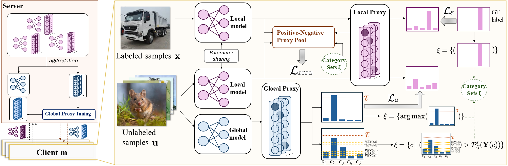

# Official PyTorch implementation of ProxyFL (CVPR‘26)
<div align="center">

<!-- Center-No-Ver-Bar-H1-H2 for GitHub, fork from https://gist.github.com/CodeByAidan/bb43bdb1c07c0933d8b67c23515fb912 -->
<div id="toc">
	<ul align="center" style="list-style: none">
		<summary>
			<h2> ProxyFL: A Proxy-Guided Framework for Federated Semi-Supervised Learning </h2>
			<h3> —— CVPR 2026 —— </h3>
		</summary>
	</ul>
</div>

[](https://arxiv.org/abs/2602.21078)



</div>


### Abstract
Federated Semi-Supervised Learning (FSSL) aims to collaboratively train a global model across clients by leveraging partially-annotated local data in a privacy-preserving manner. In FSSL, data heterogeneity is a challenging issue, which exists both across clients and within clients. External heterogeneity refers to the data distribution discrepancy across different clients, while internal heterogeneity represents the mismatch between labeled and unlabeled data within clients. Most FSSL methods typically design fixed or dynamic parameter aggregation strategies to collect client knowledge on the server (external) and / or filter out low confidence unlabeled samples to reduce mistakes in local client (internal). But, the former is hard to precisely fit the ideal global distribution via direct weights, and the latter results in fewer data participation into FL training. To this end, we propose a proxy-guided framework called ProxyFL that focuses on simultaneously mitigating external and internal heterogeneity via a unified proxy. I.e., we consider the learnable weights of classifier as proxy to simulate the category distribution both locally and globally. For external, we explicitly optimize global proxy against outliers instead of direct weights; for internal, we re-include the discarded samples into training by a positive-negative proxy pool to mitigate the impact of potentially-incorrect pseudo labels. Insight experiments & theoretical analysis show our significant performance and convergence in FSSL.

### Setup

1. Create a new Python environment:

   ```bash
   conda create --name proxyfl python=3.8.18 
   conda activate proxyfl
   ```

2. Install the required dependencies:

   ```bash
   pip install -r requirements.txt
   ```

### Dataset

Supported datasets:

* CIFAR-10
* CIFAR-100
* CINIC-10
* SVHN

Before running, please ensure the dataset paths are correctly set in `options.py`.

### Usage

Here is an example shell script to run ProxyFL on CIFAR-100 :

```bash
bash scripts/train.sh --dataset='CIFAR100' --alpha=0.1 --gpu_id=0
```

Please replace `--dataset`, `--alpha`, and `--gpu_id` with appropriate values to customize the training configuration.

### Acknowledgement
- We built our code based on: [SAGE](https://github.com/Jay-Codeman/SAGE).
